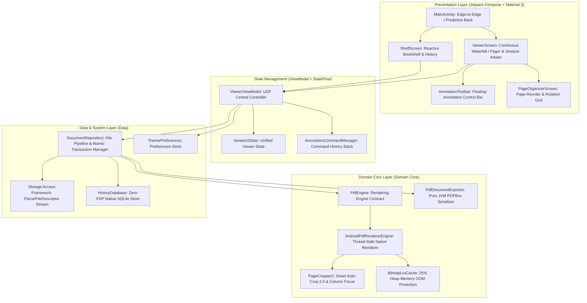

# Lumina Reader (LuminaPDF)

<p align="center">
  
  
  
  
  
</p>

<p align="center">
  <b>A Minimalist, Fast, and Focused Android PDF Reader</b><br/>
  <i>Instant Open · Smooth Rendering · Smart Auto-Crop · Eye-Care Dark Themes · Freehand Annotations · Zero Permissions</i>
</p>

<p align="center">
  <b>English</b> | <a href="doc/README_CN.md">简体中文</a>
</p>

---

## 🌟 Key Features

### ⚡ Fast & Lightweight Reading
- **Instant Rendering**: Powered by Android's framework-native `PdfRenderer` for instant cold-starts and stutter-free scrolling;
- **Memory Efficient**: Dynamic bitmap caching prevents OOM even when quickly skimming through multi-hundred page documents;
- **Pure & Focused**: Clean design without unnecessary background services, ads, or bloated features.

### ✂️ Smart Auto-Crop & Column Focus
- **Auto-Trim White Margins**: Intelligently detects and cuts paper borders, maximizing readability on mobile screens;
- **Double-Column Tap to Focus**: Tap any column in academic papers or documents to zoom and center that column automatically.

### 🌓 Eye-Care & Dark Themes
- **Tailored Dark Modes**: Includes soft dark (dim environments) and AMOLED pure black (true black for OLED battery savings);
- **Contrast Optimization**: Calibrated color matrix maps text and backgrounds for comfortable long-session reading.

### ✏️ Smooth Handwriting & Standard Annotation
- **Natural Pen & Highlighter**: Zero-drift vector handwriting that scales seamlessly with page zoom;
- **Standard PDF Export**: Saves strokes into ISO 32000-1 compliant annotations, viewable in Adobe Acrobat, browsers, and any standard reader;
- **Page Management**: Effortlessly rotate or reorder pages when needed.

### 🛡️ Privacy First & Zero Permissions
- **No Storage Permission Required**: Uses the Android Storage Access Framework (SAF) — opens files directly from chat apps, file managers, or cloud drives with zero intrusive permissions.

---

## 🏗️ Architecture Overview



---

## 📚 Technical Documentation

- 🏛️ **System Design & Architecture Specification**: [English (doc/DESIGN_EN.md)](doc/DESIGN_EN.md) | [简体中文 (doc/DESIGN.md)](doc/DESIGN.md)  
  *Comprehensive coverage of design philosophy, functional architecture, lifecycle sequence, sub-systems deep-dive (rendering, auto-crop 2.0, annotations, ISO 32000-1 export, dual dark themes, gestures, and SAF) and complete directory responsibilities.*
- 🛠️ **Developer Guide & Contribution Norms**: [English (doc/DEVELOPMENT_GUIDE_EN.md)](doc/DEVELOPMENT_GUIDE_EN.md) | [简体中文 (doc/DEVELOPMENT_GUIDE.md)](doc/DEVELOPMENT_GUIDE.md)  
  *Environment setup, Gradle commands, unit testing suites, Material 3 coding standards, concurrency & memory rules, and Conventional Commits guidelines.*

---

## 🚀 Getting Started & Build Instructions

### Prerequisites
- **Android Studio**: Meerkat (2024.3+), Ladybug (2024.2+), or newer
- **JDK**: Java 17 or 21 (Eclipse Temurin / OpenJDK 21 recommended)
- **Compile / Target SDK**: `36` (Android 16 / Baklava)
- **Min SDK**: `26` (Android 8.0 Oreo)
- **NDK**: Not required (pure JVM + Android Framework native architecture)

### Build Commands

```bash
# 1. Clone repository
git clone https://github.com/your-username/lumina-pdf.git
cd lumina-pdf

# 2. Grant execution permissions
chmod +x gradlew

# 3. Run all unit tests
./gradlew test

# 4. Assemble Debug APK
./gradlew assembleDebug
```

> Output APK is located at: `app/build/outputs/apk/debug/app-debug.apk`.

---

## 📄 License

This project is licensed under the **GNU General Public License v3.0 (GPL-3.0)**. See the [LICENSE](LICENSE) file for details.
