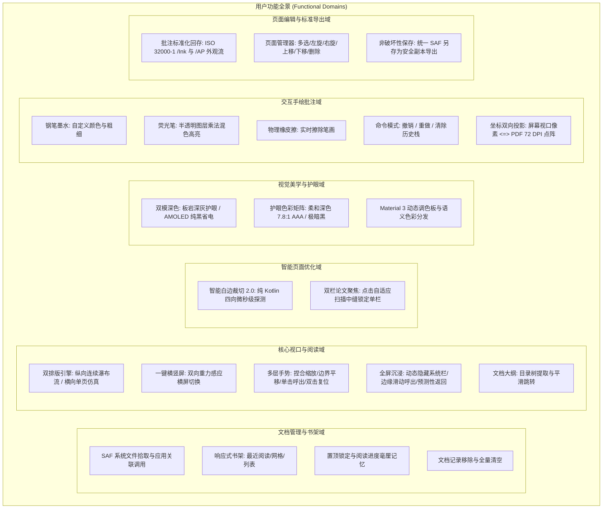
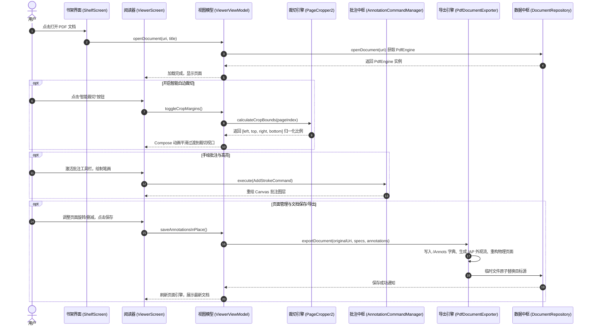
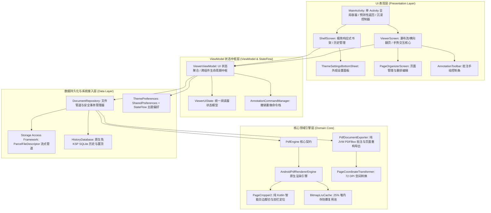

# Lumina Reader - 系统设计与架构白皮书 (System Design & Architecture Spec)

> **项目定位**：面向 Android 16+ 的下一代极简高性能 PDF 阅读器  
> **核心哲学**：极致纯粹 · 飞速渲染 · 智能白边裁切 2.0 · 双模暗黑与护眼矩阵 · 交互批注与标准回存 · 物理页面重构 · 零权限 SAF · 16KB 内存分页原生兼容  
> **文档属性**：系统唯一权威架构与功能设计全景文档  
> **语言版本 (Language)**：**简体中文** | [English Edition](DESIGN_EN.md)

---

## 1. 项目定位与核心设计哲学

### 1.1 业务背景与设计痛点
传统的 Android PDF 阅读应用往往面临以下痛点：
1. **体积臃肿与启动迟缓**：集成动辄几十兆的大型 C++ 交叉编译引擎（如旧版 MuPDF、未优化的 Pdfium），冷启动慢、内存开销极大；
2. **16KB Page Size 架构崩溃**：从 Android 15 开始逐步普及的 16KB 内存分页架构导致老旧 NDK 动态链接库出现段对齐崩溃（`dlopen failed: 16KB segment alignment`）；
3. **白边浪费与小屏阅读困难**：扫描书籍、论文普遍存在大量白边，且双栏学术论文在手机屏幕上需要频繁手动缩放和左右拖拽；
4. **夜间眩光与色彩失真**：普通反色会导致图表变负片，而传统暖色滤镜（如羊皮纸）字迹浑浊、对比度低；
5. **批注回存与生态割裂**：许多阅读器仅在本地数据库记录笔迹，无法回写为符合 ISO 32000-1 规范的标准 PDF，导致其他阅读器（Acrobat, Chrome, Edge）无法查看；
6. **权限越界滥用**：传统应用强制索取 `MANAGE_EXTERNAL_STORAGE` 或全盘存储权限，违背现代化 Android 分区存储安全规范。

### 1.2 Lumina 设计哲学
- **极简专注，纯粹克制**：专注单一 PDF 格式，拒绝工具箱式堆砌，APK 安装包控制在 **5MB 以内**，冷启动秒开；
- **全 JVM / 原生驱动，零 JNI 风险**：采用系统现代 `PdfRenderer` + 纯 JVM Apache PDFBox Android (2.0.27.0)，彻底规避 16KB Page Size 段对齐崩溃与内存泄漏；
- **算法领先，阅读增效**：纯 Kotlin 高性能白边裁切 2.0 算法（耗时 < 1.5ms），正文显示面积扩大 25%~35%，支持双栏论文一键聚焦；
- **标准互通，数据无损**：手绘笔画与高亮遵循 ISO 32000-1 规范回存为 `/Annots` 字典并构建 `/AP` 外观流，支持物理页面旋转与重排；
- **极致视觉，全链路沉浸**：Material 3 规范、板岩深灰与 AMOLED 纯黑双深色质感、WCAG AAA 7.8:1 护眼色彩矩阵、边到边（Edge-to-Edge）无缝沉浸。

---

## 2. 功能架构全景 (Functional Architecture)

### 2.1 核心功能全景图



### 2.2 核心业务流转时序 (Core Operational Lifecycle)



---

## 3. 系统总体分层架构 (System Architecture)

Lumina 严格遵循分层架构原则（Clean Architecture）与单向数据流模式（Unidirectional Data Flow, UDF）：



---

## 4. 核心子系统详细设计 (Subsystems Deep Dive)

### 4.1 原生极速渲染内核与防爆内存池 (`core/engine` & `core/cache`)

#### 4.1.1 零 JNI 依赖与 16KB Page Size 架构原生兼容
- **技术抉择**：放弃集成第三方原生 C++ 渲染库（如旧版 MuPDF 或未经 16KB 重新打包的 Pdfium），全面基于 Android 原生内置的 `android.graphics.pdf.PdfRenderer`。
- **核心收益**：
  - **APK 极致轻量**：包体积仅 **~4.8MB**，远小于传统动辄 30MB+ 的阅读器；
  - **16KB Page Size 免疫**：全面规避 Android 15/16 设备上由于 ELF 段对齐引发的 `dlopen failed: 16KB segment alignment` 崩溃问题；
  - **系统级硬件加速**：直接利用系统 Framework 底层硬件加速管道进行页面渲染。

#### 4.1.2 线程模型与并发互斥保护
`PdfRenderer` 原生不支持并发渲染同一个页面的多个实例。
`AndroidPdfRendererEngine` 通过协程上下文隔离与轻量级互斥锁保障绝对线程安全：
- 所有页面尺寸查询、大纲提取、位图渲染调度全部运行在 `Dispatchers.IO`；
- 内部封装 `kotlinx.coroutines.sync.Mutex`，在翻页激增或分辨率动态切换时对 `PdfRenderer.Page.render` 实行互斥临界区保护，杜绝底层 native crash。

#### 4.1.3 防爆内存复用池 (`BitmapLruCache`)
- 动态获取当前 Runtime 最大堆内存（`Runtime.getRuntime().maxMemory()`），分配其 **25%** 作为 Bitmap 缓存上限；
- 在用户快速滚动、连续滑动瀑布流时，自动对离开视口的页面位图执行回收和缓存复用，杜绝频繁 GC 掉帧与 OOM（Out Of Memory）。

---

### 4.2 智能白边裁切 2.0 与双栏论文聚焦算法 (`core/crop/PageCropper2.kt`)

#### 4.2.1 算法起源与色彩感知级纯 Kotlin 重构
`PageCropper2` 继承并全面升级了经典阅读器 EBookDroid 的原生 C 语言算法，采用纯 Kotlin 高性能位运算展开重构，并针对扫描版彩色/红字图文进行色彩学升级：
1. **400px 极速微缩采样**：
   - 裁切判定不在数百万像素的超清大图上运算，而是先生成 `SAMPLE_SIZE = 400` 的子图像素数组，计算耗时在现代移动处理器上稳定在 **< 1.8ms**；
2. **ITU-R BT.601 感知明度加权 (`calculateAvgLum`)**：
   - 采用国际标准明度公式：$\text{lum} = \frac{77 \times R + 150 \times G + 29 \times B}{256}$，符合人眼对红光（权重 0.299）、绿光（权重 0.587）和蓝光（权重 0.114）的真实视觉感度，彻底摒弃旧版 $\frac{\min + \max}{2}$ 将红字/红色条幅虚高折算为浅灰的弊端；
3. **色度极差 (Chroma) 与红字/色块特征向量识别 (`isContentPixel`)**：
   - 引入色彩饱和度/色度差 $\text{chroma} = \max(R,G,B) - \min(R,G,B)$，纸张白边为近无色留白 ($\text{chroma} < 15$)；
   - 对白底红字、红印章、红底白字反白条幅，提取高色度 ($\text{chroma} > 22$) 与红通道主导 ($R > 100 \land R - G > 20 \land R - B > 20$) 特征向量，无论背景亮度均可精准识别为正文内容；
4. **自适应基准背景与有效空白阈值过滤**：
   - 在白底纸张模式下锚定背景基准亮度（$\max(\text{avgLum}, 220)$），防止局部大面积暗色块拉低均值导致浅色红字漏判；
   - 引入 `WHITE_THRESHOLD = 0.005`（0.5%）的容错机制与 $LINE\_MARGIN = 15$ 安全边距，过滤扫描装订线与边缘脏点；
5. **安全边界四向探测、边缘即锁与全幅保护**：
   - 四向边缘扫描探测到首个非空白内容块时立即锁定边界（边缘命中 $x=0/y=0$ 直接锁定边界，非边缘回退安全缓冲周期），彻底摒弃原版因依赖 $whiteCount \ge 1$ 而将贴边页眉、顶栏通栏、底栏出版社等误判为边缘噪点并跨过空白跳入内层正文的问题，杜绝过度裁切与版心变形压缩；探测未命中正文或全幅纯色封面时，安全返回全图边界 `0f` 或 `1f`，杜绝封面与纯图页面被误裁或切碎。

#### 4.2.2 双栏学术论文自动聚焦 (`calculateColumnBounds`)
针对 IEEE / ACM / arXiv 双栏论文，算法根据用户点击坐标 $(tapX, tapY)$ 自动探测：
- 结合全局背景基准亮度（`max(200, calculateAvgLum)`），解决点击黑色文字局部导致亮度差分失效的边界问题；
- 向左、右两翼自适应扫描栏间空白中缝，精确定位单栏文本的最佳视口坐标，使学术文献阅读告别繁琐的手动横向拖动。

---

### 4.3 交互式手绘批注与命令模式系统 (`core/annotation`)

#### 4.3.1 批注领域模型 (`AnnotationModel.kt`)
- `AnnotationTool`：定义三种工具：
  - `PEN`：实心墨水笔迹；
  - `HIGHLIGHTER`：半透明高亮笔（默认透明度 0.35f，采用 BlendMode 正片叠底/叠加效果）；
  - `ERASER`：笔画级物理橡皮擦。
- `DrawingPath`：单条笔画数据实体，包含页面索引、点阵序列（`List<StrokePoint>`）、颜色 RGBA、线宽及工具类型；
- `PageAnnotation`：单页批注集合模型。

#### 4.3.2 命令模式与撤销/重做栈 (`AnnotationCommand.kt`)
采用标准 Command 模式设计：
- `AnnotationCommand` 接口：声明 `execute()` 与 `undo()`；
- `AddStrokeCommand`：执行时向页面批注列表中追加笔画，撤销时移除；
- `RemoveStrokeCommand`：执行时移除笔画，撤销时原位还原；
- `ClearPageAnnotationCommand`：执行时清空单页批注，撤销时完整恢复；
- `AnnotationCommandManager`：维护 `undoStack` 与 `redoStack`，提供线程安全的统一撤销、重做与可撤销状态监听。

#### 4.3.3 视口像素与 PDF 72 DPI 标准空间双向投影 (`PageCoordinateTransformer.kt`)
屏幕显示分辨率（包含系统 Density、Compose 缩放比 Scale、白边裁切偏移）与 PDF 物理页面坐标系存在差异：
- **屏幕视口坐标**：原点位于左上角，单位为物理像素 (px)；
- **PDF 标准坐标**：原点位于左下角（Y 轴向上），单位为 72 DPI 点阵 (Point)；
- `PageCoordinateTransformer` 实现了双向精确映射：
  $$\begin{cases}
  X_{\text{pdf}} = X_{\text{normalized}} \times W_{\text{pdfPage}} \\
  Y_{\text{pdf}} = (1.0 - Y_{\text{normalized}}) \times H_{\text{pdfPage}}
  \end{cases}$$
确保在任意屏幕分辨率、任意缩放比例下绘制的笔画，回存至 PDF 时位置与大小毫无偏差。

---

### 4.4 PDF 标准批注回存与物理页面编辑导出引擎 (`core/export` & `data/repository`)

#### 4.4.1 纯 JVM 引擎选型：Apache PDFBox Android (2.0.27.0)
为实现标准 PDF 写入而无需引入庞大的 C++ 工具链，项目采用经 Android 优化的纯 Java/JVM 库 `com.tom-roush:pdfbox-android`：
- **零 JNI 风险**：无任何 `.so` 本地动态库，100% 免疫 16KB Page Size 崩溃；
- **全平台一致性**：直接操作 PDF 底层对象树（`COSDictionary`、`COSArray`、`PDPage`、`PDDocument`）。

#### 4.4.2 ISO 32000-1 规范回存与 `/AP` 外观流构建
若仅向 PDF 写入坐标点，许多非 Adobe 官方阅读器（如浏览器 PDF 插件、微信内置阅读器）无法渲染批注。`PdfDocumentExporter` 严格遵循 ISO 32000-1 规范：
1. **写入 `/Annots` 字典**：
   - 设定 `/Type /Annot`，`/Subtype /Ink`；
   - 构造 `/InkList` 嵌套数组，存放点阵序列；
   - 设置 `/C` 笔触颜色向量 `[R, G, B]`；
   - 设置 `/CA` (Constant Stroke Alpha)，将荧光笔透明度标准化存入；
2. **构建 `/AP` (`PDAppearanceStream`) 外观流**：
   - 利用 `PDPageContentStream` 在独立外观 XObject 流中直接写入 PDF 操作符：
     - `w` (线宽)
     - `RG` (描边颜色)
     - `m` (移动到起点)
     - `l` (画线到坐标)
     - `S` (描边路径)
   - 经过标准 `/AP` 流构建后，导出的 PDF 在任何现代设备、操作系统及浏览器上均能 100% 忠实还原笔迹与荧光笔高亮。

#### 4.4.3 物理页面编辑引擎 (`PageOrganizerScreen` & `PageEditSpec`)
支持无损的页面物理属性调整与重构：
- **页面旋转**：修改 `PDPage.rotation` 字典字段（支持 90°、180°、270° 顺时针/逆时针物理旋转）；
- **页面重构与删减**：通过 `PageEditSpec` 声明目标页码序列，在导出时构建全新的 `PDPageTree`，实现页面重排与无用页面物理剔除。

#### 4.4.4 临时文件安全事务原地覆写 (Atomic In-Place Save)
覆盖原始文档时，为防止进程意外终止导致源文件损坏，`DocumentRepository` 采用原子事务：
1. 先将修改内容导出到应用沙盒私有缓存目录下的临时文件 `temp_export_*.pdf`；
2. 校验临时文件大小与完整性；
3. 以 `openFileDescriptor(uri, "rwt")` 模式打开目标 SAF 管道，将临时文件字节流完整传输写入；
4. 成功后删除临时文件，关闭旧引擎并无缝重载新引擎；若失败则安全回滚，原始文件丝毫不受影响。

---

### 4.5 全景双模暗黑主题与护眼色彩映射系统 (`ui/theme` & `ui/settings`)

#### 4.5.1 双深色质感与 Material 3 调色板映射

| 语义角色 | 日间浅色 (`Light`) | 板岩深灰 (`SlateDark`) | AMOLED 纯黑 (`AmoledDark`) | 核心用途 |
| :--- | :--- | :--- | :--- | :--- |
| **`primary`** | `#0284C7` (天青蓝) | `#38BDF8` (明澈天蓝) | `#38BDF8` (明澈天蓝) | 强调色、FAB、进度条、激活指示器 |
| **`onPrimary`** | `#FFFFFF` | `#00354E` | `#00354E` | 强调色上的前景文字与图标 |
| **`background`** | `#F8FAFC` (极浅云灰) | `#020617` (星空墨蓝) | `#000000` (AMOLED 纯黑) | 应用全屏基底、阅读画板 |
| **`surface`** | `#FFFFFF` | `#0F172A` (深板岩灰) | `#0C0C0E` (微曜黑) | 卡片表面、底部弹窗面板、大纲抽屉 |
| **`surfaceVariant`** | `#F1F5F9` | `#1E293B` | `#18181B` | 控件底色、进度条轨道、次级面板 |
| **`outlineVariant`** | `#E2E8F0` | `#1E293B` (深色微边框) | `#1F1F23` (纯黑微边框) | 卡片轻描边，防止纯黑粘连 |

#### 4.5.2 护眼色彩矩阵与眩光消除 (`ReadingColorMode`)
- **废除传统羊皮纸模式**：传统暖黄乘法滤镜对比度低、字迹模糊，已在项目中彻底移除；
- **柔和深色护眼模式 (`ReadingColorMode.SOFT_DARK`)**：
  - 基于线性 `ColorMatrix` 精准映射：白底 $255 \to \#1E222B$，黑字 $0 \to \#D6DCE5$；
  - 彻底消除传统夜间反色强刺目眩光，对比度维持在最佳 **7.8:1 WCAG AAA** 黄金舒适阅读区间；
- **极暗纯黑模式 (`ReadingColorMode.AMOLED_DARK`)**：
  - 针对 OLED 屏幕，底色完全吸光省电（`#000000`），文字降低至柔和冷银白，实现零像素发光与极致续航。

#### 4.5.3 全链路 Edge-to-Edge 边到边沉浸
- 调用 `enableEdgeToEdge()`，系统状态栏与底部手势导航条彻底透明；
- 状态栏图标明暗随主题自动毫秒级自适应反转；
- `res/values-night/themes.xml` 提供原生夜间主题配置，杜绝应用冷启动过程中的白屏闪烁。

---

### 4.6 手势交互调度与沉浸式阅读控制器 (`ui/viewer` & `MainActivity`)

#### 4.6.1 多层级手势冲突消解流水线
1. **单指未缩放状态（`scale <= 1.05f`）**：手势处理器不拦截消费任何 Touch Pointer 事件，滑动无损传递给外层滚动容器（纵向 `LazyColumn` 或横向 `HorizontalPager`），保障原汁原味的系统级滚动物理动量；
2. **双指捏合（Pinch-to-Zoom）**：捕获双指触控计算 `calculateZoom()`，支持 1.0x ~ 4.0x 连续平滑缩放，缩放期间独占消费手势以锁定滚动容器；
3. **放大后单指拖拽**：在 `scale > 1.05f` 时接管单指位移，在当前放大页面视图边界内进行平移，并限制最大位移避免漂出屏幕；
4. **单击（Single Tap）**：点击页面非正文边缘或内容区，灵敏唤出或隐藏悬浮菜单与控制面板；
5. **双击（Double Tap）**：放大状态下一键复位至 1.0x 原始比例；原始比例下双击触发双栏论文单栏自动聚焦。

#### 4.6.2 分级预测性返回拦截（Predictive Back）
配合 Android 14~16 预测性返回机制，实现优雅的分级响应：
- **第一级**：目录大纲抽屉或页面管理弹窗打开时，返回键优先平滑关闭弹窗；
- **第二级**：沉浸全屏模式开启时，返回键退出全屏、恢复系统状态栏与交互面板；
- **第三级**：批注处于未保存状态时，弹出确认对话框；确认后退出阅读界面并返回书架，恢复系统默认方向。

---

### 4.7 零权限 SAF 存储与免 KSP 轻量持久化 (`data`)

#### 4.7.1 严格 Scoped Storage 与流式管道
- 应用清单中不声明任何危险存储权限；
- 通过 `ActivityResultContracts.OpenDocument` 或系统 `ACTION_VIEW` Intent 获得 `content://` 授权 Uri；
- 基于 `ContentResolver.openFileDescriptor(uri, "r")` 获取只读或可读写文件描述符，直接对接解码管道。

#### 4.7.2 原生免 KSP SQLite 持久化 (`HistoryDatabase`)
- 采用原生 Android `SQLiteOpenHelper` 搭配 Kotlin 协程 `StateFlow` 实现全响应式数据流；
- 避免引入 Room 框架及 KSP 编译插件，杜绝在 Kotlin 2.x 大版本演进中的兼容断层，保证秒级增量编译体验。

---

## 5. 完整工程目录结构与职责说明

```
app/src/main/
├── AndroidManifest.xml                        # 清单配置 (Edge-to-Edge 沉浸、PDF Intent 响应、零危险权限)
├── java/org/lumina/reader/
│   ├── LuminaApp.kt                           # 应用程序入口 (PDFBoxResourceLoader 初始化)
│   ├── MainActivity.kt                        # 单 Activity 容器 (预测性返回、沉浸式窗口控制器、Intent 调度)
│   ├── core/                                  # 核心领域引擎层
│   │   ├── annotation/                        # 批注子系统
│   │   │   ├── AnnotationModel.kt             # 笔画、工具、颜色数据模型
│   │   │   ├── AnnotationCommand.kt           # 撤销/重做命令模式与历史栈管理器
│   │   │   └── PageCoordinateTransformer.kt   # 屏幕视口像素 <=> PDF 72 DPI 空间双向几何变换
│   │   ├── crop/                              # 页面裁切子系统
│   │   │   └── PageCropper2.kt                # 智能白边裁切 2.0 与双栏定位纯 Kotlin 算法
│   │   ├── engine/                            # 渲染引擎抽象与实现
│   │   │   ├── PdfEngine.kt                   # 渲染引擎契约接口
│   │   │   └── AndroidPdfRendererEngine.kt    # 原生 PdfRenderer 线程安全实现与并发互斥
│   │   ├── export/                            # 导出与物理页面重构子系统
│   │   │   └── PdfDocumentExporter.kt         # 纯 JVM PDFBox 批注回存、/AP 外观流构建与页面重排导出
│   │   ├── cache/                             # 内存缓存
│   │   │   └── BitmapLruCache.kt              # 25% 可用堆内存防爆位图复用池
│   │   └── model/                             # 核心数据模型
│   │       └── PdfModels.kt                   # 几何尺寸、阅读滤镜、排版模式与页面重排规格 (PageEditSpec)
│   ├── data/                                  # 数据与持久化层
│   │   ├── db/                                # 本地轻量数据库
│   │   │   ├── HistoryDatabase.kt             # 免 KSP 原生 SQLite 历史与置顶记录管理器
│   │   │   └── RecentDocument.kt              # 书架历史记录数据实体
│   │   ├── preferences/                       # 用户偏好持久化
│   │   │   └── ThemePreferences.kt            # 主题模式与深色质感偏好配置 (SharedPreferences + StateFlow)
│   │   └── repository/                        # 存储管道中枢
│   │       └── DocumentRepository.kt          # SAF 管道接入、临时文件事务原子覆盖保存与另存为导出
│   └── ui/                                    # UI 表现层 (Jetpack Compose + Material 3)
│       ├── shelf/                             # 书架视图
│       │   └── ShelfScreen.kt                 # 极简响应式书架、最近文档、置顶、搜索与文件拾取
│       ├── viewer/                            # 阅读器主视图与组件
│       │   ├── ViewerScreen.kt                # 核心阅读器主屏、多层手势冲突调度与全屏沉浸容器
│       │   ├── ViewerViewModel.kt             # 单向数据流 (UDF) 视图状态控制器
│       │   └── components/                    # 阅读器专用交互组件
│       │       ├── ViewerTopBar.kt            # 顶部操作条 (返回、大纲抽屉、保存、另存为、页面管理入口)
│       │       ├── ViewerBottomBar.kt         # 底部工具栏 (快速跳转滑块、横竖屏切换、智能裁切、护眼模式)
│       │       ├── AnnotationToolbar.kt       # 悬浮批注工具条 (钢笔/荧光笔/橡皮擦/调色板/粗细/撤销重做)
│       │       ├── PageOrganizerScreen.kt     # 页面管理全屏对话框 (缩略图网格、旋转、重排、删除)
│       │       ├── PdfPageView.kt             # 页面渲染承载视图、Canvas 批注图层与手势响应
│       │       ├── ViewerOutlineDrawer.kt     # 文档目录大纲滑出式抽屉
│       │       └── ViewerDialogs.kt           # 页码直接跳转、文档详情与关于应用 (作者: eddy) 对话框
│       ├── settings/                          # 设置视图
│       │   └── ThemeSettingsBottomSheet.kt   # 现代 M3 外观设置面板 (跟随系统、浅色、板岩深灰、AMOLED 纯黑)
│       └── theme/                             # 主题与设计规范
│           ├── Color.kt                       # 品牌天蓝与语义色彩槽定义
│           ├── Theme.kt                       # Material 3 调色板装配与沉浸式系统栏控制器
│           └── Type.kt                        # 现代化排印规范
└── res/
    ├── values/themes.xml                      # 日间模式初始主题配置
    └── values-night/themes.xml                # 夜间模式原生主题 (杜绝冷启动白屏闪烁)
```
