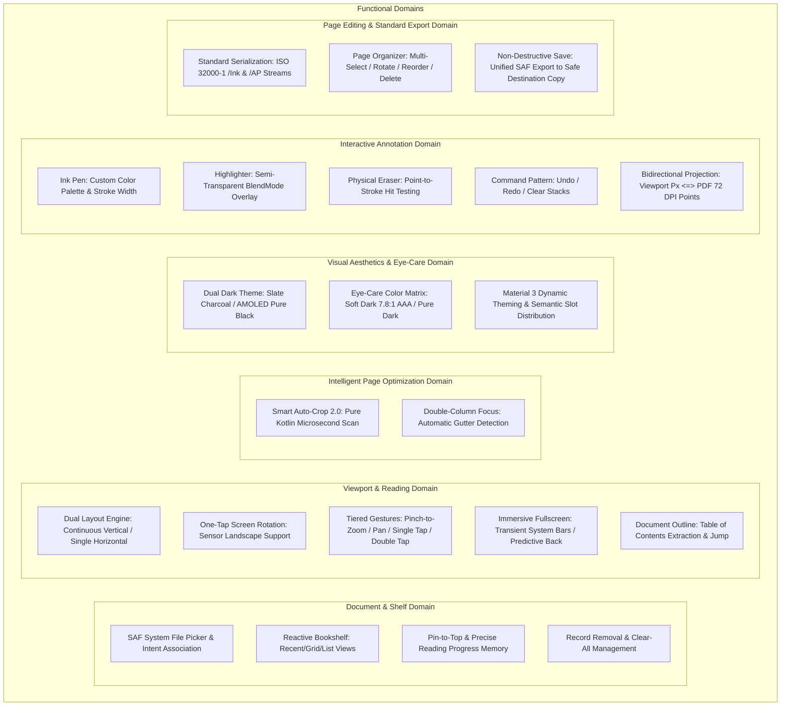
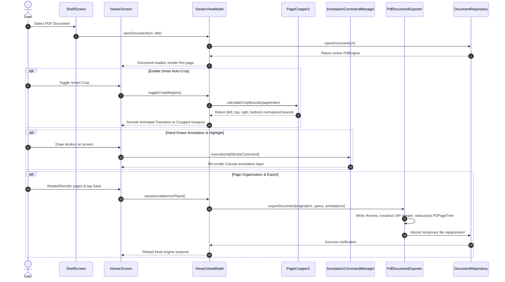

# Lumina Reader - System Design & Architecture Specification

> **Positioning**: Next-Gen Minimalist High-Performance PDF Reader Built for Android 16+  
> **Core Philosophy**: Extreme Purity · Lightning-Fast Rendering · Smart Auto-Crop 2.0 · Dual-Style Dark Theme · Interactive Annotations with Standard Export · Physical Page Reorganization · Zero-Permission SAF · Native 16KB Page Size Immunity  
> **Document Purpose**: Authoritative, unified system architecture and functional design blueprint  
> **Language**: [简体中文](DESIGN.md) | **English Edition**

---

## 1. Product Positioning & Core Philosophy

### 1.1 Industry Background & Technical Pain Points
Traditional Android PDF reading applications suffer from several critical shortcomings:
1. **Bloated Package & Sluggish Cold Start**: Integrating heavy C++ cross-compiled engines (e.g., legacy MuPDF or unoptimized native Pdfium) inflates package size (30MB~50MB+) and leads to high heap memory consumption.
2. **16KB Memory Page Size Crashes**: Beginning with Android 15 and required on Android 16, devices adopt 16KB memory page alignment. Legacy NDK `.so` libraries crash immediately upon launch with `dlopen failed: 16KB segment alignment`.
3. **Small-Screen Reading Fatigue & Wasted Margins**: Scanned books, papers, and slide handouts have wide white borders. Double-column academic articles require continuous manual zooming and erratic panning.
4. **Night Glare & Color Distortion**: Standard screen inversion turns charts, graphs, and photos into washed-out negatives. Traditional sepia filters provide poor contrast and muddy letter edges.
5. **Annotation Fragmentation**: Many apps only store scribbles in private local databases without writing back compliant ISO 32000-1 annotations, making notes invisible in standard desktop tools like Adobe Acrobat, Chrome, or Edge.
6. **Permission Intrusion**: Demanding dangerous permissions (`MANAGE_EXTERNAL_STORAGE` or legacy external storage) violates modern Android Scoped Storage security standards.

### 1.2 Lumina's Design Philosophy
- **Minimalist & Pure**: Dedicated strictly to PDF. Zero bloated utility clutter. Sub-**5MB** APK footprint with instantaneous cold start.
- **Pure JVM & Framework-Native / Zero JNI Risk**: Leverages the system's hardware-accelerated `android.graphics.pdf.PdfRenderer` for real-time rendering, alongside pure JVM Apache PDFBox Android (2.0.27.0) for standard serialization—completely eliminating 16KB segment crashes.
- **Microsecond-Level Smart Crop**: Re-engineered purely in Kotlin bitwise operations (< 1.5ms per page), expanding readable text area by 25%~35% with single-tap double-column auto-focus.
- **Standards-Compliant Serialization**: Vector strokes and highlights are written directly into standard `/Annots` dictionaries (`/Subtype /Ink`) with dedicated `/AP` (`PDAppearanceStream`) streams, supporting physical `/Rotate` and page rearrangement.
- **Full Edge-to-Edge Immersion**: Material 3 tonal palettes, Slate Charcoal & AMOLED Pure Black styles, and WCAG AAA 7.8:1 color matrix mapping with adaptive system bar luminance.

---

## 2. Functional Architecture

### 2.1 Core Functional Map



### 2.2 Operational Lifecycle Flow



---

## 3. System Architecture & Layering

Lumina strictly adheres to Clean Architecture and Unidirectional Data Flow (UDF):

```mermaid
graph TD
    subgraph Presentation Layer (Jetpack Compose + Material 3)
        MainActivity[MainActivity: Edge-to-Edge / Predictive Back / Intent Dispatcher]
        ShelfScreen[ShelfScreen: Reactive Bookshelf & History Management]
        ViewerScreen[ViewerScreen: Continuous Waterfall / Pager & Gesture Arbiter]
        ThemeSheet[ThemeSettingsBottomSheet: Appearance Customization Sheet]
        OrganizerSheet[PageOrganizerScreen: Page Reorder & Rotation Grid]
        AnnotBar[AnnotationToolbar: Floating Annotation Control Bar]
    end

    subgraph State Management (ViewModel & StateFlow)
        VM[ViewerViewModel: UI State Aggregator & Cross-Component Mediator]
        UIState[ViewerUiState: Unified Reading State Model]
        AnnotMgr[AnnotationCommandManager: Command History Stack]
    end

    subgraph Domain Core Layer (Core)
        Engine[PdfEngine Contract]
        NativeEngine[AndroidPdfRendererEngine: Thread-Safe Native Renderer]
        Cropper[PageCropper2: Pure Kotlin Auto-Crop & Column Focus]
        CoordTrans[PageCoordinateTransformer: 72 DPI Bidirectional Projection]
        Exporter[PdfDocumentExporter: Pure JVM PDFBox Annotation & Export Engine]
        Cache[BitmapLruCache: 25% Heap Memory OOM Protection Pool]
    end

    subgraph Data & System Layer (Data)
        Repo[DocumentRepository: File Pipeline & Atomic Transaction Manager]
        SAF[Storage Access Framework: ParcelFileDescriptor Stream]
        HistoryDB[HistoryDatabase: Zero-KSP Native SQLite Store]
        ThemePref[ThemePreferences: SharedPreferences + StateFlow Store]
    end

    MainActivity --> ShelfScreen
    MainActivity --> ViewerScreen
    ShelfScreen --> ThemeSheet
    ShelfScreen --> VM
    ViewerScreen --> VM
    ViewerScreen --> OrganizerSheet
    ViewerScreen --> AnnotBar
    VM --> UIState
    VM --> AnnotMgr
    VM --> Repo
    Repo --> Engine
    Engine --> NativeEngine
    NativeEngine --> Cropper
    NativeEngine --> Cache
    Repo --> Exporter
    Exporter --> CoordTrans
    Repo --> SAF
    Repo --> HistoryDB
    VM --> ThemePref
```

---

## 4. Subsystems Deep Dive

### 4.1 Native Rendering Engine & OOM Defense (`core/engine` & `core/cache`)

#### 4.1.1 Zero JNI Dependency & Native 16KB Page Size Alignment
- **Architecture Choice**: Bypasses heavy native C++ engines, utilizing Android's framework-level `android.graphics.pdf.PdfRenderer`.
- **Benefits**:
  - **Ultra-Compact Size**: Entire APK remains under **5MB**;
  - **16KB Page Size Immunity**: Completely exempt from NDK ELF segment alignment crashes on Android 15 and 16;
  - **Framework Hardware Acceleration**: Draws directly to native `Bitmap` backed by hardware pipes.

#### 4.1.2 Thread Concurrency & Mutex Protection
`PdfRenderer` does not support concurrent access across multiple pages.
`AndroidPdfRendererEngine` enforces strict thread safety:
- All queries, outline parses, and rasterizations execute under `withContext(Dispatchers.IO)`;
- Critical sections are guarded by `kotlinx.coroutines.sync.Mutex`, preventing native crashes during fast scrolling or mode switching.

#### 4.1.3 OOM Guard Pool (`BitmapLruCache`)
- Dynamically allocates **25%** of runtime max heap (`Runtime.getRuntime().maxMemory()`) as the bitmap cache ceiling;
- Automatically reclaims and recycles off-screen page bitmaps during rapid scrolling, preventing GC pauses and Out Of Memory errors.

---

### 4.2 Smart Auto-Crop 2.0 & Column Focus (`core/crop/PageCropper2.kt`)

#### 4.2.1 Pure Kotlin Bitwise Re-engineering
Ported from EBookDroid's classic native C algorithm and optimized for modern ARM/x86 JVM execution:
1. **400px Sub-Sample**: Generates a low-cost `SAMPLE_SIZE = 400` pixel array; execution time is **< 1.5ms** on modern SoCs;
2. **Dynamic Baseline Luminance (`calculateAvgLum`)**:
   $\text{lum} = \frac{\min(R,G,B) + \max(R,G,B)}{2}$, calculating the global page average luminance;
3. **Thresholding & Noise Suppression**:
   Dark pixel rule: $(\text{lum} < \text{avgLum}) \land ((\text{avgLum} - \text{lum}) \times 10 > \text{avgLum})$;
   Tolerates up to 0.5% dark pixels (`WHITE_THRESHOLD = 0.005`) to discard staple marks, scanner artifacts, and binding lines;
4. **Boundary Detection**: Safely falls back to `0f` or `1f` if no non-white content is detected, preventing blank pages from being corrupted.

#### 4.2.2 Academic Paper Double-Column Auto-Focus (`calculateColumnBounds`)
- Detects the nearest column gutter based on tap coordinate $(tapX, tapY)$;
- Combines global background luminance to prevent misdetections when tapping directly on black text;
- Automatically computes the single-column viewport bounding box, eliminating horizontal panning while reading two-column papers.

---

### 4.3 Interactive Annotations & Command Pattern (`core/annotation`)

#### 4.3.1 Domain Model (`AnnotationModel.kt`)
- `AnnotationTool`: `PEN` (solid ink), `HIGHLIGHTER` (semi-transparent multiply blend, alpha 0.35), `ERASER` (stroke-level eraser);
- `DrawingPath`: Single stroke entity containing page index, point sequence (`List<StrokePoint>`), RGBA color, stroke width, and tool type.

#### 4.3.2 Command History Stack (`AnnotationCommand.kt`)
- Follows the classic Command pattern (`execute()` and `undo()`);
- `AddStrokeCommand`, `RemoveStrokeCommand`, and `ClearPageAnnotationCommand`;
- Managed by `AnnotationCommandManager` with thread-safe `undoStack` and `redoStack`.

#### 4.3.3 Coordinate System Projection (`PageCoordinateTransformer.kt`)
- **Screen Viewport**: Top-left origin, physical pixels ($px$), affected by display density and zoom scale;
- **Standard PDF**: Bottom-left origin (Y-axis upward), measured in 72 DPI points;
- `PageCoordinateTransformer` ensures that drawings made under any display resolution or zoom level map precisely to the PDF page coordinates:
  $$\begin{cases}
  X_{\text{pdf}} = X_{\text{normalized}} \times W_{\text{pdfPage}} \\
  Y_{\text{pdf}} = (1.0 - Y_{\text{normalized}}) \times H_{\text{pdfPage}}
  \end{cases}$$

---

### 4.4 Standard PDF Serialization & Physical Page Editing (`core/export` & `data/repository`)

#### 4.4.1 Pure JVM Engine: Apache PDFBox Android (2.0.27.0)
- **Zero JNI**: Pure Java bytecode; 100% compliant with 16KB page alignment;
- **Full DOM Control**: Reads and modifies native PDF object trees (`PDDocument`, `PDPage`, `COSDictionary`, `COSArray`).

#### 4.4.2 ISO 32000-1 Compliance & `/AP` Stream Generation
1. **`/Annots` Dictionary**:
   - Sets `/Type /Annot`, `/Subtype /Ink`;
   - Encodes coordinates in `/InkList`;
   - Stores RGB stroke color in `/C` and alpha in `/CA`;
2. **`/AP` (`PDAppearanceStream`) Generation**:
   - Generates vector content streams (`w`, `RG`, `m`, `l`, `S`);
   - Guarantees seamless display across all external PDF viewers (Adobe Acrobat, Chrome, Safari, Edge, WeChat).

#### 4.4.3 Physical Page Editing (`PageOrganizerScreen` & `PageEditSpec`)
- **Rotation**: Updates `PDPage.rotation` (supports 90°, 180°, 270°);
- **Reordering & Deletion**: Constructs a restructured `PDPageTree` according to `PageEditSpec`.

#### 4.4.4 Atomic In-Place File Replacement
- Exports the modified document to a temporary file in the sandbox cache (`temp_export_*.pdf`);
- Verifies integrity and file size;
- Streams content atomically into the target SAF `ParcelFileDescriptor` (`openFileDescriptor(uri, "rwt")`);
- Protects original files from corruption in case of unexpected process termination.

---

### 4.5 Dual-Style Dark Theme & Eye-Care System (`ui/theme` & `ui/settings`)

#### 4.5.1 Palette Matrix

| Semantic Role | Daylight (`Light`) | Slate Charcoal (`SlateDark`) | Pure Black (`AmoledDark`) | Usage |
| :--- | :--- | :--- | :--- | :--- |
| **`primary`** | `#0284C7` (Azure) | `#38BDF8` (Sky) | `#38BDF8` (Sky) | Core accent, FAB, active indicators |
| **`onPrimary`** | `#FFFFFF` | `#00354E` | `#00354E` | Foreground on primary |
| **`background`** | `#F8FAFC` (Cloud White) | `#020617` (Deep Ink) | `#000000` (AMOLED Black) | Global background |
| **`surface`** | `#FFFFFF` | `#0F172A` (Slate Charcoal) | `#0C0C0E` (Microlite Black)| Cards, sheets, drawer |
| **`surfaceVariant`** | `#F1F5F9` | `#1E293B` | `#18181B` | Secondary containers |
| **`outlineVariant`** | `#E2E8F0` | `#1E293B` | `#1F1F23` | Subtle border delimiters |

#### 4.5.2 Color Matrix Mapping (`ReadingColorMode`)
- **Soft Dark (`ReadingColorMode.SOFT_DARK`)**:
  Maps $255 \to \#1E222B$ (background) and $0 \to \#D6DCE5$ (text), maintaining a **7.8:1 WCAG AAA** golden reading contrast ratio;
- **AMOLED Pure Dark (`ReadingColorMode.AMOLED_DARK`)**:
  Pure black `#000000` background for zero-power OLED pixels with muted silver text.

---

### 4.6 Tiered Gesture Arbitration & Immersive Control (`ui/viewer` & `MainActivity`)

1. **Unzoomed Panning (`scale <= 1.05f`)**: Touch events pass directly to `LazyColumn` or `HorizontalPager` for native scroll momentum;
2. **Pinch-to-Zoom**: Captures multi-touch points to scale from 1.0x to 4.0x, locking the scroll container;
3. **Zoomed Panning**: Intercepts single-finger dragging when `scale > 1.05f`, clamping within page bounds;
4. **Single Tap**: Toggles floating toolbars;
5. **Double Tap**: Toggles between 1.0x and zoom level or activates single-column focus.

---

### 4.7 Zero-Permission SAF & Zero-KSP Persistence (`data`)

- **Scoped Storage**: Interacts solely via `content://` URIs obtained via `OpenDocument` or `ACTION_VIEW`;
- **Zero-KSP SQLite Database (`HistoryDatabase`)**: Uses native `SQLiteOpenHelper` with `StateFlow`, eliminating KSP build overhead and Kotlin version lock-in.

---

## 5. Directory Structure & Module Responsibilities

```
app/src/main/
├── AndroidManifest.xml                        # App manifest (Edge-to-Edge, PDF intent filter, zero dangerous permissions)
├── java/org/lumina/reader/
│   ├── LuminaApp.kt                           # Application entry (PDFBoxResourceLoader initialization)
│   ├── MainActivity.kt                        # Single Activity (Predictive back, immersive bars, intent routing)
│   ├── core/                                  # Core Domain Engines
│   │   ├── annotation/                        # Annotation Subsystem
│   │   │   ├── AnnotationModel.kt             # Stroke, tool, and color domain models
│   │   │   ├── AnnotationCommand.kt           # Command pattern undo/redo history manager
│   │   │   └── PageCoordinateTransformer.kt   # Viewport pixels <=> PDF 72 DPI point projection
│   │   ├── crop/                              # Smart Crop Subsystem
│   │   │   └── PageCropper2.kt                # Pure Kotlin Auto-Crop 2.0 & double-column focus algorithm
│   │   ├── engine/                            # PDF Engine Abstraction & Native Implementation
│   │   │   ├── PdfEngine.kt                   # Core engine interface
│   │   │   └── AndroidPdfRendererEngine.kt    # Native PdfRenderer wrapper with Mutex concurrency protection
│   │   ├── export/                            # Export & Page Restructuring
│   │   │   └── PdfDocumentExporter.kt         # Pure JVM PDFBox serializer (/Annots, /AP stream, rotation, reorder)
│   │   ├── cache/                             # Bitmap Cache
│   │   │   └── BitmapLruCache.kt              # 25% heap memory OOM protection pool
│   │   └── model/                             # Data Entities
│   │       └── PdfModels.kt                   # Page dimensions, filter modes, layouts, and PageEditSpec
│   ├── data/                                  # Data Layer
│   │   ├── db/                                # SQLite Persistence
│   │   │   ├── HistoryDatabase.kt             # Zero-KSP native SQLite history & pinning database
│   │   │   └── RecentDocument.kt              # Shelf document entity
│   │   ├── preferences/                       # Preferences
│   │   │   └── ThemePreferences.kt            # Theme mode and dark style storage (SharedPreferences + StateFlow)
│   │   └── repository/                        # Document Operations Pipeline
│   │       └── DocumentRepository.kt          # SAF pipeline, atomic in-place file overwrite & save-as export
│   └── ui/                                    # Presentation Layer (Jetpack Compose + Material 3)
│       ├── shelf/                             # Bookshelf
│       │   └── ShelfScreen.kt                 # Minimalist bookshelf, search, pinning, and file opening
│       ├── viewer/                            # Viewer
│       │   ├── ViewerScreen.kt                # Reader main screen, gesture arbiter & immersive container
│       │   ├── ViewerViewModel.kt             # UDF state controller ViewModel
│       │   └── components/                    # Viewer Specialized Components
│       │       ├── ViewerTopBar.kt            # Top bar (Navigation, outline, save, save-as, organizer entry)
│       │       ├── ViewerBottomBar.kt         # Bottom bar (Slider, layout toggle, rotation, crop, eye-care)
│       │       ├── AnnotationToolbar.kt       # Floating annotation toolbar (Pen/Highlighter/Eraser/Colors/Undo)
│       │       ├── PageOrganizerScreen.kt     # Fullscreen page organizer (Grid, rotation, reorder, delete)
│       │       ├── PdfPageView.kt             # Page renderer, interactive Canvas annotation layer
│       │       ├── ViewerOutlineDrawer.kt     # Table of contents drawer
│       │       └── ViewerDialogs.kt           # Jump-to-page, document info & About App (Author: eddy) dialogs
│       ├── settings/                          # Settings
│       │   └── ThemeSettingsBottomSheet.kt   # Modern M3 theme configuration bottom sheet
│       └── theme/                             # Design System
│           ├── Color.kt                       # Brand colors and semantic slot definitions
│           ├── Theme.kt                       # Material 3 color schemes and system bar controller
│           └── Type.kt                        # Modern typography system
└── res/
    ├── values/themes.xml                      # Base daylight theme
    └── values-night/themes.xml                # Native dark theme (prevents cold-start white flash)
```
