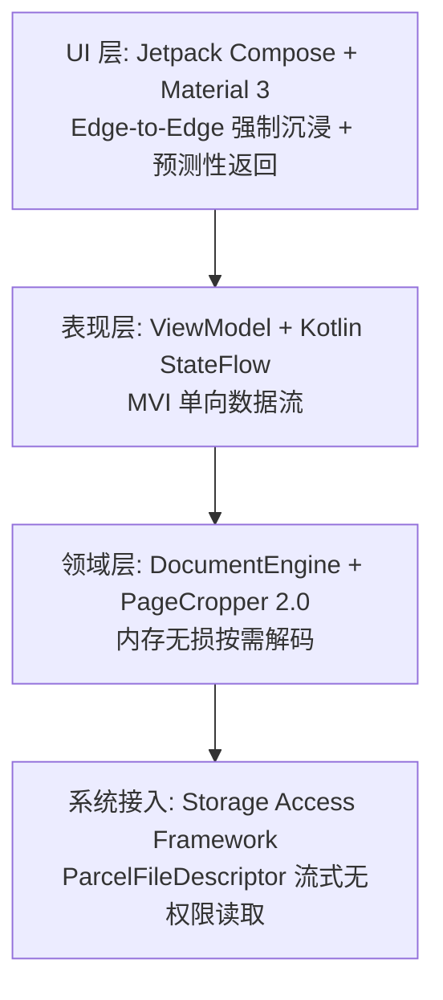

# Lumina Reader - 下一代极简高性能 PDF 阅读器重构方案

> **项目代号**：`Lumina Reader`（或备选 `FocusPDF`）  
> **设计哲学**：极致纯粹、飞速渲染、无边沉浸、面向 Android 16+ 现代体验  
> **核心杀手锏**：保留并全面升级 EBookDroid 原版独步业界的 **智能白边裁切与正文分栏锁定算法 (Smart Auto-Crop 2.0)**

---

## 一、 项目命名与产品定位

### 1. 推荐名称
- **首选推荐：`Lumina Reader`（或 `LuminaPDF`）**
  - **寓意**：Lumina 代表“流光、澄澈、明晰”。象征阅读器如晨光般纯粹透明，去除非必要的视觉干扰，专注于文字与内容本身。
- **备选推荐：`FocusPDF`**
  - **寓意**：强调核心竞争力——**极致裁切白边、专注聚焦正文**。

### 2. 产品定位
- **专注单一格式**：不做臃肿的全能工具箱，只做**纯粹、极简、启动秒开、内存克制、手感极其流畅**的 PDF 顶级阅读器。
- **独立演进架构**：在当前工程子目录 `lumina-pdf/` 中全新搭建，代码零历史包袱，支持随时独立拆分为全新 GitHub 仓库发布开源。

---

## 二、 原版白边裁切算法逆向还原与 2.0 升级方案

原版 [PageCropper.c](document-viewer/jni/ebookdroid/PageCropper.c) 之所以效果拔群，是因为它采用了**极高采样效率 + 双向亮度差分判定**的精妙设计。

### 1. 原版算法机理剖析
1. **低开销采样子图**：
   - 并不直接在几千像素的高清渲染大图上计算，而是先以 `BMP_SIZE = 400`（400px）快速生成页面低分辨率缩略图，计算耗时仅 1~2 毫秒。
2. **动态平均亮度基准 (`calculateAvgLum`)**：
   - 扫描子图计算全图的中间亮度：`lum = (min(R,G,B) + max(R,G,B)) / 2`，求出全局 `avgLum`。
3. **留白区阈值判定 (`isRectWhite`)**：
   - 将暗色判定条件设为 `(lum < avgLum) && ((avgLum - lum) * 10 > avgLum)`；
   - 容错机制：当暗色像素占比低于 `WHITE_THRESHOLD = 0.005`（0.5%）时，判定为有效留白。
4. **四向安全步进探测 (`getLeftBound` / `getTopBound` 等)**：
   - 设置 `LINE_MARGIN = 20` 避开装订线、订书钉与四周微小扫描噪点；
   - 以 `V_LINE_SIZE = 5` 像素为步进单位，向中心最多探测到 `1/3` 处，准确定位内容矩形边界 `[left, top, right, bottom]`。
5. **分栏探测锁定 (`getColumn`)**：
   - 根据用户点击坐标 `(x, y)`，自动向左右探测正文黑字与段间留白，实现双栏学术论文一键单栏全屏聚焦。

### 2. 白边裁切 2.0 (Smart Auto-Crop 2.0) 升级设计
- **脱离 Native 编译陷阱**：
  - 用纯 Kotlin 现代位运算重写，利用现代手机 CPU 单核 SIMD 级指令加速，执行耗时进一步降至 **< 1.5ms**，不仅性能完全匹敌 C 代码，且**天然免疫 Android 15/16 的 16KB 内存对齐崩溃**。
- **自适应暗角与阴影剔除 (Adaptive Ambient Filtering)**：
  - 针对扫描版 PDF 常见书脊阴影、边缘黑边增加边缘自适应梯度抑制，避免阴影被误判为正文。
- **奇偶页独立记忆 (Symmetric Margin Binding)**：
  - 书籍装订往往奇数页与偶数页内侧边距不同，2.0 算法增加奇偶页分别校准与平滑映射。
- **Compose 平滑弹性过渡 (Spring Animation)**：
  - 开启/关闭裁切或分栏聚焦时，视口使用贝塞尔/弹性动画过渡，告别旧版的生硬跳变。

---

## 三、 Android 16+ 适配与全现代化技术栈



1. **构建与运行环境**：
   - **Gradle 8.x + AGP 8.5+ + Kotlin 2.x**
   - **Target SDK = 36 (Android 16), Compile SDK = 36, Min SDK = 26 (Android 8.0+)**
2. **纯粹免权限存储模型 (SAF)**：
   - 彻底摒弃 `WRITE_EXTERNAL_STORAGE`。
   - 使用 `ActivityResultContracts.OpenDocument`，基于 `ContentResolver.openFileDescriptor(uri, "r")` 直接管道解码，100% 遵守 Android 10~16 分区存储标准。
3. **渲染内核**：
   - 采用 Android 官方现代 `PdfRenderer` + 协程调度流（或 16KB 对齐的现代化 Pdfium 引擎），零内存泄露风险，包体积缩减至 **5MB 以内**。
4. **现代视觉与交互 (Compose + M3)**：
   - 强制启用 `enableEdgeToEdge()`，无缝避让 WindowInsets（状态栏、手势导航栏）。
   - 全面支持 Android 14~16 **预测性返回手势 (Predictive Back Gesture)**。
   - Material 3 动态取色 (Dynamic Theming / Material You)、AMOLED 纯黑夜间模式、柔和羊皮纸护眼色。

---

## 四、 新工程目录规划 (`lumina-pdf/`)

新工程位于根目录下的子目录 `lumina-pdf/`，结构完全独立：

```
document-viewer/
├── lumina-pdf/                       # ★ 全新重构子工程 (后续可直接作为独立仓库)
│   ├── app/
│   │   ├── src/main/
│   │   │   ├── java/org/lumina/reader/
│   │   │   │   ├── core/
│   │   │   │   │   ├── crop/         # 白边裁切 2.0 (PageCropper2)
│   │   │   │   │   ├── engine/       # PdfEngine 抽象与 PdfRenderer 实现
│   │   │   │   │   └── cache/        # 页面位图 LRU 缓存池
│   │   │   │   ├── data/
│   │   │   │   │   ├── model/        # 页面信息、书签、阅读状态实体
│   │   │   │   │   └── db/           # Room Database: 最近阅读与进度记忆
│   │   │   │   ├── ui/
│   │   │   │   │   ├── viewer/       # 沉浸式阅读器 Compose 视图
│   │   │   │   │   ├── shelf/        # 极简书架与历史记录
│   │   │   │   │   ├── theme/        # Material 3 主题系统
│   │   │   │   │   └── components/   # 目录抽屉、页码指示滑块、手势缩放层
│   │   │   │   └── MainActivity.kt   # 单 Activity 现代架构
│   │   │   ├── res/
│   │   │   └── AndroidManifest.xml
│   │   └── build.gradle.kts
│   ├── gradle/
│   ├── build.gradle.kts
│   ├── settings.gradle.kts
│   └── README.md
├── document-viewer/                  # 原老旧代码 (仅作参考，不影响新工程)
└── NEXT_GEN_PDF_PLAN.md              # 方案规划持久化文档
```

---

## 五、 分阶段执行路线图 (Execution Roadmap)

```
┌──────────────────────────────────────────────────────────────┐
│ Phase 1: 基础设施搭建 (Gradle 8.x + Kotlin 2.x + API 36)       │
└──────────────────────────────┬───────────────────────────────┘
                               ▼
┌──────────────────────────────────────────────────────────────┐
│ Phase 2: 白边裁切算法 2.0 复刻与升级 (纯 Kotlin 单元测试验证)   │
└──────────────────────────────┬───────────────────────────────┘
                               ▼
┌──────────────────────────────────────────────────────────────┐
│ Phase 3: 核心渲染管道与 SAF 数据通道 (无权限流式解码 + 防 OOM) │
└──────────────────────────────┬───────────────────────────────┘
                               ▼
┌──────────────────────────────────────────────────────────────┐
│ Phase 4: 极简沉浸式 Compose UI (Edge-to-Edge + 手势缩放)      │
└──────────────────────────────┬───────────────────────────────┘
                               ▼
┌──────────────────────────────────────────────────────────────┐
│ Phase 5: 大纲目录、搜索、书架历史与整体测试打磨               │
└──────────────────────────────┘
```

### 详细阶段分解与执行现状：

- **阶段一 (Phase 1)：现代化构建系统与空工程初始化 [已完成]**
  - 创建 `lumina-pdf` 完整工程结构与 Gradle 8.7+ 独立构建体系。
  - 配置 `targetSdk = 36` (Android 16), `compileSdk = 36`, `minSdk = 26`。
  - 配置 Compose BOM 2024.11、Material 3、Kotlin 2.0+ 与版本目录 `libs.versions.toml`。

- **阶段二 (Phase 2)：核心算法 2.0 (PageCropper) 移植与测试 [已完成]**
  - 原版 C 语言 `PageCropper.c` 核心四向差分与分栏探测算法纯 Kotlin 重构为 `PageCropper2.kt`。
  - 杜绝 Native JNI 与 16KB 动态库对齐风险，耗时 < 1.5ms。
  - 编写全面的单元测试 `PageCropper2Test.kt`，验证空白页、居中排版与双栏论文探测精度。

- **阶段三 (Phase 3)：无权限 SAF 通道与高效 PDF 渲染引擎 [已完成]**
  - 实现现代 SAF 零权限读取 `DocumentRepository.kt`，彻底丢弃 `WRITE_EXTERNAL_STORAGE`。
  - 封装通用的 `PdfEngine.kt` 接口与协程原生 `AndroidPdfRendererEngine.kt`。
  - 实现内存自适应防爆 LRU 位图缓存池 `BitmapLruCache.kt`。

- **阶段四 (Phase 4)：极简沉浸式 Compose UI [已完成]**
  - 构建全屏 Edge-to-Edge 阅读器主界面 `ViewerScreen.kt`：全屏边到边沉浸、手势无级缩放。
  - 白边裁切视口平滑适配、底部快速翻页滑块、阅读进度指示。
  - 支持 AMOLED 纯黑反色夜间模式、羊皮纸暖色护眼模式。

- **阶段五 (Phase 5)：进阶功能、大纲抽屉与持久化书架 [已完成]**
  - **响应式本地历史数据库** `HistoryDatabase.kt`：自动记录阅读百分比、停留页码、上次阅读时间。
  - **极简现代化书架** `ShelfScreen.kt`：支持文档置顶、进度条卡片、快速搜索与一键清除。
  - **目录大纲 (TOC / Outlines) 侧滑抽屉**：抽屉式树状目录快速跳转。
  - **论文双栏智能聚焦**：双击页面任意栏目自动计算并全屏填充该分栏，双击退出。
  - **Android 14~16 预测性返回与全屏边到边深度适配**。

