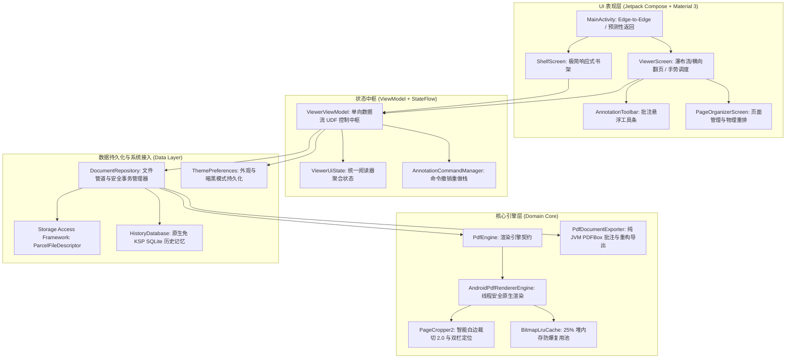

# Lumina Reader (LuminaPDF) - 项目说明

<p align="center">
  
  
  
  
  
  
</p>

<p align="center">
  <b>面向 Android 16+ 的下一代极简高性能 PDF 阅读器</b><br/>
  <i>Next-Gen Minimalist High-Performance Android PDF Reader · Built for Android 16+</i><br/>
  <b>飞速渲染 · 智能白边裁切 2.0 · 双模暗黑护眼 · 交互批注与标准回存 · 物理页面重构 · 零权限 SAF · 16KB Page Size 原生兼容</b>
</p>

<p align="center">
  <a href="../README.md">English</a> | <b>简体中文</b>
</p>

---

## 🌟 核心亮点 (Key Highlights)

### ⚡ 原生 16KB Page Size 架构与纯 JVM 零 JNI 风险
- **原生内存分页兼容**：采用 Android 原生内置 `android.graphics.pdf.PdfRenderer` 与纯 JVM Apache PDFBox Android (2.0.27.0)，全项目**无任何第三方 C/C++ 动态链接库 (`.so`)**；
- **杜绝段对齐崩溃**：彻底免疫 Android 15/16 常见的 16KB Page Size ELF 段对齐崩溃（`dlopen failed: 16KB segment alignment`）；
- **极致轻量秒开**：APK 安装包压缩至 **5MB 以内**，冷启动瞬时秒开，内存占用克制，集成 `BitmapLruCache`（25% 堆内存动态上限）实现快速滚动防爆。

### ✂️ 智能白边裁切 2.0 & 双栏论文单栏聚焦
- **微秒级算法**：传承并升级 EBookDroid 经典四向亮度差分探测算法，纯 Kotlin 位运算高性能重构，子图探测耗时 **< 1.5ms**；
- **消除边缘留白**：自动识别切除扫描件、书籍与文献四周空白边缘，使正文有效显示面积扩大 **25% ~ 35%**；
- **双栏论文一键聚焦**：阅读 IEEE / ACM 等双栏学术论文时，轻触正文即可自动扫描中缝空白并全屏居中放大单栏，告别繁琐手动拖移。

### 🌓 全景双模暗黑主题与护眼色彩矩阵
- **同源双深色质感**：
  - **板岩深灰 (Slate Charcoal)**：采用 `#0F172A` / `#1E293B` 色阶，层次细腻，夜间阅读温和不刺眼；
  - **极致纯黑 (AMOLED Pure Black)**：采用 `#000000` 纯黑，实现 OLED 屏幕像素熄灭与零功耗；
- **WCAG AAA 7.8:1 护眼映射**：摒弃传统模糊发黄的羊皮纸模式，采用线性 `ColorMatrix` 精确将白底黑字压缩映射至黄金阅读舒适区间；
- **全链路 Edge-to-Edge**：系统状态栏与手势导航栏完全透明，图标明暗自动毫秒级适配，冷启动内置 `values-night` 杜绝白屏闪烁。

### ✏️ 交互式手绘批注与 Undo/Redo 命令栈
- **丰富工具矩阵**：提供钢笔墨水、荧光笔半透明叠加高亮（BlendMode 正片叠底）以及笔画级物理橡皮擦；
- **完整命令模式**：支持多级撤销（Undo）、重做（Redo）与单页清空操作历史栈；
- **双向高精度投影**：通过 `PageCoordinateTransformer` 实现屏幕视口物理像素与 PDF 72 DPI 标准点阵空间无损映射。

### 📑 ISO 32000-1 标准批注回存与物理页面编辑重构
- **标准互通回存**：基于纯 JVM 引擎将笔迹与荧光笔写入 ISO 32000-1 标准 `/Annots` 字典（`/Subtype /Ink`），并自动构建 `/AP` (`PDAppearanceStream`) 外观流，确保导出文档在 Adobe Acrobat、Chrome、Edge 等所有第三方阅读器中完美呈现；
- **物理页面管理**：支持页面顺时针/逆时针 90° 物理旋转（`/Rotate`）、多选删除与顺序重排重构；
- **原子事务覆盖**：采用应用私有临时文件与流式管道进行安全校验覆盖，杜绝意外中断导致原始文件损坏。

### 🛡️ 纯零权限 Scoped Storage 设计
- **无任何危险存储权限**：无需申请 `MANAGE_EXTERNAL_STORAGE` 或全盘读写权限；
- **SAF 原生生态联动**：无缝对接系统文件选择器、下载管理器、微信聊天文件与邮件附件直接调用。

---

## 🏗️ 架构概览 (Architecture Overview)



---

## 📚 详细技术文档 (Documentation)

- 🏛️ **[系统设计与架构白皮书 (doc/DESIGN.md)](DESIGN.md)** ([English Edition](DESIGN_EN.md))：包含系统设计哲学、功能架构全景图、业务流转时序、核心子系统剖析（渲染内核、白边裁切 2.0 算法、批注与命令模式、PDF 标准回存与物理页面重构导出、双模暗黑与色彩矩阵、手势冲突调度、SAF 存储）以及完整工程目录职责表。
- 🛠️ **[开发者指南与工程规范 (doc/DEVELOPMENT_GUIDE.md)](DEVELOPMENT_GUIDE.md)** ([English Edition](DEVELOPMENT_GUIDE_EN.md))：开发环境搭建、常用 Gradle 构建与单元测试命令、Material 3 编码准则、线程与内存防爆规则、原子事务规范与 Conventional Commits 提交准则。

---

## 🚀 快速开始与构建 (Getting Started)

### 开发环境要求
- **Android Studio**：Ladybug (2024.2+)、Meerkat (2024.3+) 或更高版本
- **JDK**：Java 17 或 21 (推荐 Temurin / OpenJDK 21)
- **Compile / Target SDK**：`36` (Android 16 / Baklava)
- **Min SDK**：`26` (Android 8.0 Oreo)
- **NDK**：无需安装 NDK（纯 JVM + Android Framework 原生架构）

### 构建与测试

```bash
# 1. 克隆代码仓库
git clone https://github.com/your-username/lumina-pdf.git
cd lumina-pdf

# 2. 赋予 gradlew 执行权限
chmod +x gradlew

# 3. 运行全量单元测试
./gradlew test

# 4. 编译 Debug 安装包
./gradlew assembleDebug
```

> 编译生成的安装包位于：`app/build/outputs/apk/debug/app-debug.apk`。

---

## 📄 开源许可证 (License)

本项目遵循 **GNU General Public License v3.0 (GPL-3.0)** 开源协议，详情请参阅 [LICENSE](../LICENSE) 文件。
