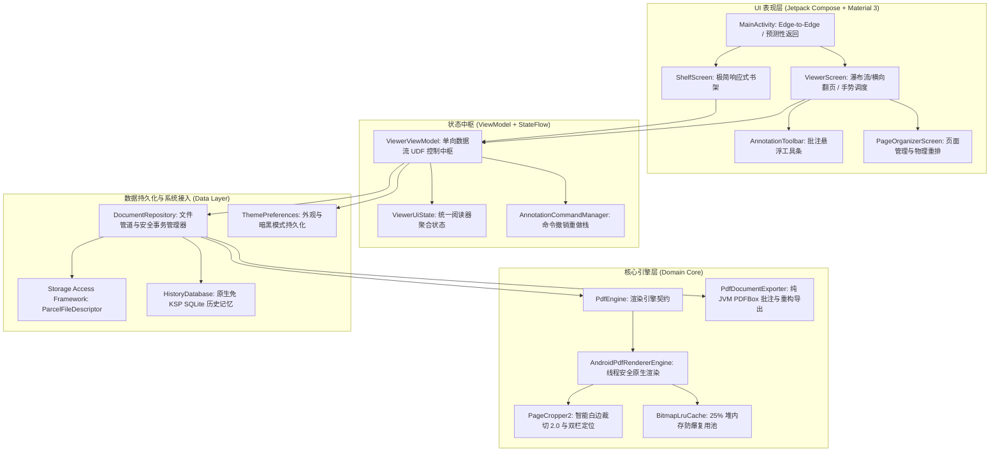

# Lumina Reader (LuminaPDF) - 项目说明

<p align="center">
  
  
  
  
  
</p>

<p align="center">
  <b>极简、轻快、专注的 Android PDF 阅读器</b><br/>
  <i>秒开即读 · 丝滑流畅 · 智能切白边 · 护眼深色 · 随心批注 · 零多余权限</i>
</p>

<p align="center">
  <a href="../README.md">English</a> | <b>简体中文</b>
</p>

---

## 🌟 核心特性 (Key Features)

### ⚡ 飞速渲染 · 极简轻快
- **秒开即读**：基于 Android 原生硬件加速渲染引擎，大文件瞬时加载，连续滚动丝滑跟手；
- **低内存占用**：智能位图复用与缓存机制，百页长文档快速翻页杜绝 OOM；
- **纯粹无打扰**：无冗余常驻后台、无广告推送，专注于 PDF 阅读本身。

### ✂️ 智能白边裁切 · 双栏聚焦
- **自动切白边**：自动识别并裁除文献与扫描件的页面多余留白，最大化屏幕文字有效面积；
- **双栏论文一键聚焦**：双击或轻触双栏学术论文正文，自动识别中缝并居中单栏放大。

### 🌓 护眼色调 · 双模深色
- **双深色主题**：提供板岩深灰（夜间柔和）与 AMOLED 纯黑（OLED 像素省电）两种主题；
- **智能色彩映射**：线性色彩矩阵精准调和底色与文字对比度，长时间阅读温和不伤眼。

### ✏️ 丝滑手绘 · 标准批注回存
- **无感手写**：钢笔与荧光笔高精度贴合触控，在页面缩放下依然零跳变、零漂移、粗细自适应；
- **标准格式回存**：批注完全符合 ISO 32000-1 规范，保存后可在 Adobe Acrobat、浏览器等任意第三方阅读器完整查看；
- **页面轻松整理**：支持页面快速旋转与顺序调整。

### 🛡️ 零多余权限 · 尊重隐私
- **无需存储权限**：遵循 Android 存储访问框架 (SAF)，不申请读写或管理外部存储等敏感权限；
- **即开即看**：无缝调用微信、邮件、网盘与系统文件管理器中的文档。

---

## 🏗️ 架构概览 (Architecture Overview)



---

## 📚 详细技术文档 (Documentation)

- 🏛️ **[系统设计与架构白皮书 (doc/DESIGN.md)](DESIGN.md)** ([English Edition](DESIGN_EN.md))：包含系统设计哲学、功能架构全景图、业务流转时序、核心子系统剖析（渲染内核、白边裁切 2.0 算法、批注与命令模式、PDF 标准回存与物理页面重构导出、双模暗黑与色彩矩阵、手势冲突调度、SAF 存储）以及完整工程目录职责表。
- 🛠️ **[开发者指南与工程规范 (doc/DEVELOPMENT_GUIDE.md)](DEVELOPMENT_GUIDE.md)** ([English Edition](DEVELOPMENT_GUIDE_EN.md))：开发环境搭建、常用 Gradle 构建与单元测试命令、Material 3 编码准则、线程与内存防爆规则、原子事务规范与 Conventional Commits 提交准则。

---

## 🚀 快速开始与构建 (Getting Started)

### 开发环境要求
- **Android Studio**：Ladybug (2024.2+)、Meerkat (2024.3+) 或更高版本
- **JDK**：Java 17 或 21 (推荐 Temurin / OpenJDK 21)
- **Compile / Target SDK**：`36` (Android 16 / Baklava)
- **Min SDK**：`26` (Android 8.0 Oreo)
- **NDK**：无需安装 NDK（纯 JVM + Android Framework 原生架构）

### 构建与测试

```bash
# 1. 克隆代码仓库
git clone https://github.com/your-username/lumina-pdf.git
cd lumina-pdf

# 2. 赋予 gradlew 执行权限
chmod +x gradlew

# 3. 运行全量单元测试
./gradlew test

# 4. 编译 Debug 安装包
./gradlew assembleDebug
```

> 编译生成的安装包位于：`app/build/outputs/apk/debug/app-debug.apk`。

---

## 📄 开源许可证 (License)

本项目遵循 **GNU General Public License v3.0 (GPL-3.0)** 开源协议，详情请参阅 [LICENSE](../LICENSE) 文件。
